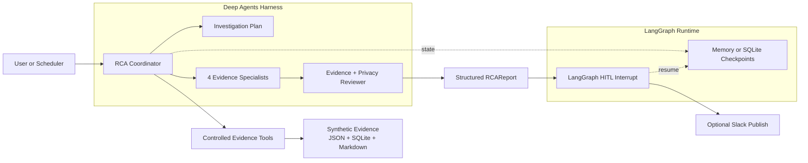

# Deep Agents + LangGraph RCA


**Companion article:** [The Architecture Around the Agent Matters More Than the Prompt](https://recohut-sparsh.medium.com/the-architecture-around-the-agent-matters-more-than-the-prompt-0ae1cf8bc51a)

This public proof of concept demonstrates a governed root-cause-analysis agent built with Deep Agents on the LangGraph runtime.

It uses synthetic task-delivery evidence so the architecture can be inspected without exposing private systems or real employee data.

## What This Repository Proves

The repository demonstrates that Deep Agents on LangGraph can:

- discover investigation cases from raw evidence;
- create a plan and select specialists dynamically;
- isolate specialist context and tools;
- use a governed virtual filesystem;
- produce evidence-backed structured RCA reports;
- review claims before synthesis;
- change conclusions when evidence changes;
- pause before an external Slack side effect;
- support memory or persistent SQLite checkpoints.

It does not claim production HR correctness, legal readiness, independent multi-model verification, or production durability without a persistent deployment.

## Architecture



## Deep Agents Versus LangGraph

Deep Agents is the harness: tools, skills, specialist subagents, virtual filesystem permissions, response schema, and the human-interrupt boundary.

LangGraph is the runtime underneath: thread state, checkpoints, streaming, interrupts, and resume semantics.

The application owns the evidence adapters, synthetic data, Slack configuration, duplicate-send prevention, scheduler adapter, feedback records, docs, and tests.

## Five-Minute Setup

```bash
python -m venv .venv
source .venv/bin/activate
pip install -e ".[dev]"
cp .env.example .env
```

Tests do not require a model key or Slack token:

```bash
pytest
python scripts/check_public_repository.py
```

Live model execution is optional. Configure any OpenAI-compatible endpoint:

```text
MODEL_NAME=
MODEL_BASE_URL=
MODEL_API_KEY=
```

## Run One Investigation

After setting model configuration:

```bash
python scripts/run_investigation.py --as-of 2026-07-17 --run-id demo-reference
```

For a controlled single-case run:

```bash
python scripts/run_investigation.py --as-of 2026-07-17 --task-id EMP002-T05 --run-id demo-emp002
```

## Inspect Plans, Delegation, Evidence, And RCA

Runtime artifacts are written under `runs/`. The agent can write only to this workspace and can read only the skill files. It cannot browse `data/`, tests, docs, `.env`, or expected outputs directly.

The source tools expose evidence with provenance. The model decides what to investigate and what conclusion is supported.

## Run The Counterfactual Suite

```bash
python scripts/run_counterfactual_suite.py --as-of 2026-07-17 --task-id EMP002-T05 --run-id cf-suite
```

The suite compares:

- reference evidence;
- removed access evidence;
- reversed access evidence;
- renamed blind evidence.

Validation should focus on changed conclusions and evidence use, not exact prose.

## Enable SQLite Checkpoints

Memory checkpointing is the default:

```text
CHECKPOINTER_BACKEND=memory
```

For local restart-safe checkpoint persistence:

```bash
pip install -e ".[sqlite]"
```

```text
CHECKPOINTER_BACKEND=sqlite
```

SQLite checkpoints are stored in `runs/checkpoints.sqlite`. This demonstrates local persistence. A production service should use managed persistent storage, usually Postgres.

## Optional Slack Approval

The RCA can run without Slack. Slack is used only for a guarded external side effect.

Set:

```text
SLACK_CHANNEL=#task-rca-demo
SLACK_BOT_TOKEN=xoxb-...
```

Preview the approval boundary:

```bash
python scripts/preview_channel_update.py --run-id demo-approval --decision reject --message "Draft RCA update"
```

Publishing is interrupted by LangGraph before the `send_channel_update` tool, and duplicate publication for the same run is prevented.

## Tests And Claim Boundaries

Run:

```bash
pytest
git diff --check
python scripts/check_public_repository.py
```

The safety checks look for local absolute paths, private `.env` files, private run-history artifacts, and common token patterns.

Read:

- `docs/architecture.md`
- `docs/evidence.md`
- `docs/validation-method.md`
- `docs/public-boundaries.md`
- `docs/slack-setup.md`
- `docs/checkpointing.md`
